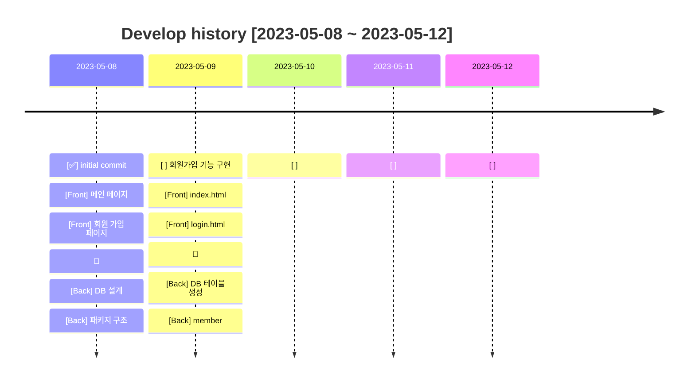
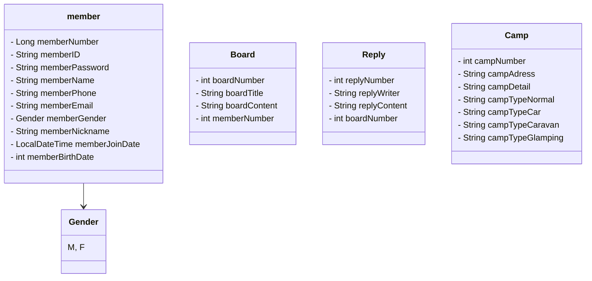
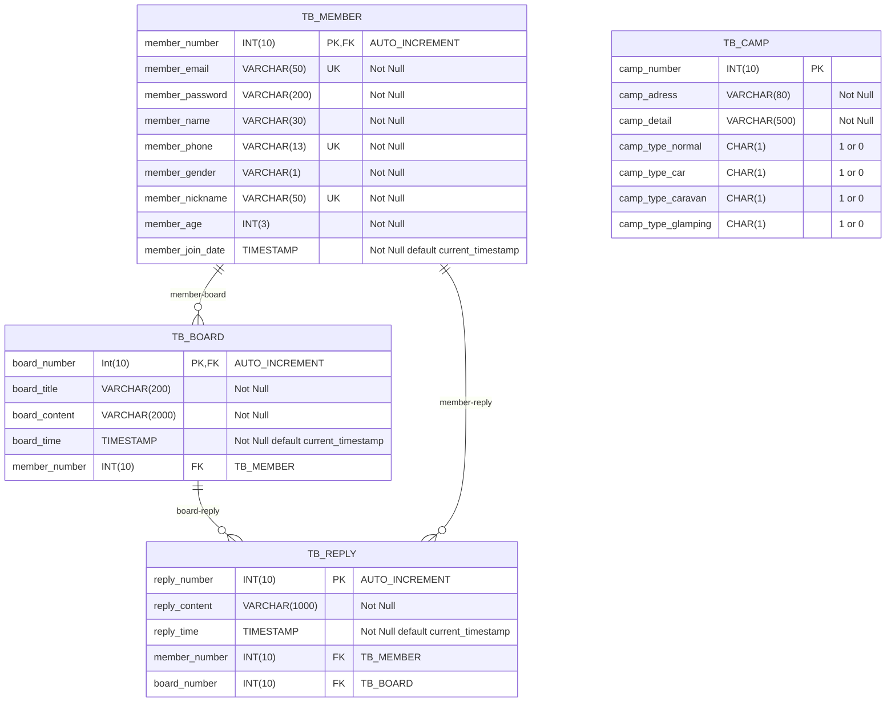
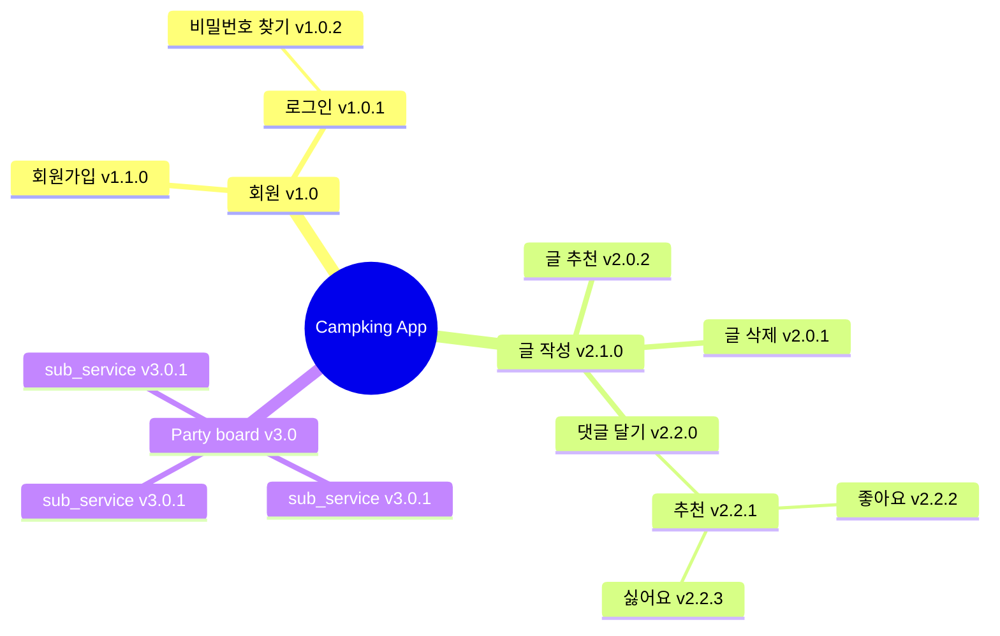
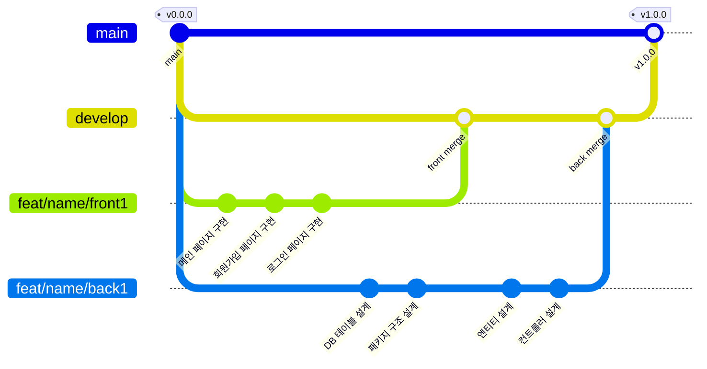

# ⛺️ CampKing Project

 

### 🎉 개요

---

- 저희 서비스는 캠프 여행을 혼자다니기 외로우신 분들을 위해 만들게 되었습니다.
- 여행지를 기준으로 같이 캠핑을 갈 멤버들을 모집할 수 있습니다.
- 저희는 우선 제주도를 시작으로 전국적으로 확대해 나갈 예정입니다.
- 캠프 여행을 혼자가기 싫다면 이 앱을 이용해보세요.

 

### 💻 Members

---

| 개발자       | 담당              | gitHub                                       | 한 마디   |
|-----------|-----------------|----------------------------------------------|--------|
| 🧑‍💻 송유근 | 👉 PM & Front   | [🐈‍⬛ gitHub](https://github.com/golddrone7) | 하면 된다! |
| 👩‍💻 박수민 | 👉 Front        | [🐈‍⬛ gitHub](https://github.com/330sum)     | 하면 된다! |
| 👩‍💻 조예원 | 👉 Front & Back | [🐈‍⬛ gitHub](https://github.com/JOY0987)    | 하면 된다! |
| 👩‍💻 최예진 | 👉 Back         | [🐈‍⬛ gitHub](https://github.com/Yajani)     | 하면 된다! |
| 🧑‍💻 이기덕 | 👉 Back         | [🐈‍⬛ gitHub](https://github.com/lkdcode)    | 하면 된다! |

 
 

### 📚 Skill Stack

---

- #### 📜 FRONT

  

- #### 🛠️ BACK

- #### 📀 DB

- #### ✂️ Tool

 
 
 

### 🗓️ 개발 이력

---

 
 
 

### 🖇️ Version Information

 

#### ✅ v1.0.0

---

- #### V1.0 개발 전략
    - [v1.0.0] 회원가입을 성공시킨다
        - [Front] 홈페이지로부터 유저의 ID 와 password 를 입력받는다
        - [Back] 회원가입된 아이디는 DB에 저장된다

 
 
 

### 🚀 Class Diagram

---

 
 
 

### 📀 DataBase Diagram

---

 

 
 
 
 

### 📍 MindMap

---

#### 📌 2023.05.08 ~ 2023.05.12 V1.0.0

 
 

### 🪵 Git Flow

---

 

- #### main : 우리의 서비스가 출시되는 브랜치

> 1. 태그를 달아서 버전을 알려줍니다.
> 2. develop 브랜치만 merge 합니다.  
     $git merge develop  
     $git tag "v1.0.0"

- #### develop : 다음 출시 버전을 개발하는 브랜치

> 1. feat 브랜치들에서 개발한 병합합니다.
> 2. 커밋 이력을 남기기 위해 '--no-ff' 옵션을 부여합니다.  
     $git merge --no-ff feat/[name]/기능

- #### feat/[name]/front : Front 기능을 개발하는 브랜치
- #### feat/[name]/back : Back 기능을 개발하는 브랜치
- #### feat/이름이니셜/개발내용. ex) feat/lkd/member

> 1. feat/[이름 이니셜]/구현 기능 요약  
     $git switch -c feat/lkd/member  
     $작업중...  
     $작업 완료...  
     $git branch develop  
     $git merge --no-ff feat/lkd/member

- #### hotfix : 출시 버전에서 발생한 버그를 수정하는 브랜치

 
 

 
 
 
 

### 🖇️ Reference

---

- [COMMON]  
  [👉 UML](https://www.nextree.co.kr/p6753/)      
  [👉 클래스 다이어그램 툴](https://app.diagrams.net/?src=about)  
  [👉 README_mermaid](https://mermaid.js.org/syntax/flowchart.html)  
  [👉 Git_flow1](https://techblog.woowahan.com/2553/)  
  [👉 Git_flow2](https://www.youtube.com/watch?v=wtsr5keXUyE&ab_channel=%EC%9A%B0%EC%95%84%ED%95%9C%ED%85%8C%ED%81%AC)

- [FRONT]  
  [👉 daisy_UI](https://daisyui.com/components/)    
  [👉 font_awesome](https://fontawesome.com/search?o=r&m=free)    
  [👉 tail_wind](https://nerdcave.com/tailwind-cheat-sheet)

- [BACK]  
  [👉 Java 컨벤션](https://developerfarm.wordpress.com/2012/02/03/object_calisthenics_summary/)  
  [👉 디자인 패턴](https://refactoring.guru/ko/design-patterns/what-is-pattern)

- [DB]  
  [👉 Null](https://naver.com)