# ⛺️ CampKing Project

 

### 🎉 개요

---

- 저희 서비스는 캠프 여행을 혼자다니기 외로우신 분들을 위해 만들게 되었습니다.
- 여행지를 기준으로 같이 캠핑을 갈 멤버들을 모집할 수 있습니다.
- 저희는 우선 제주도를 시작으로 전국적으로 확대해 나갈 예정입니다.
- 캠프 여행을 혼자가기 싫다면 이 앱을 이용해보세요.

 

### 💻 Members

---

| 개발자       | 담당              | gitHub                                       | 한 마디   | MBTI |
|-----------|-----------------|----------------------------------------------|--------|------|
| 🧑‍💻 송유근 | 👉 PM & Front   | [🐈‍⬛ gitHub](https://github.com/golddrone7) | 하면 된다! | ISFP |
| 👩‍💻 박수민 | 👉 Front        | [🐈‍⬛ gitHub](https://github.com/330sum)     | 하면 된다! | ENFP |
| 👩‍💻 조예원 | 👉 Front & Back | [🐈‍⬛ gitHub](https://github.com/JOY0987)    | 하면 된다! | ESTP |
| 👩‍💻 최예진 | 👉 Back         | [🐈‍⬛ gitHub](https://github.com/Yajani)     | 하면 된다! | INTJ |
| 🧑‍💻 이기덕 | 👉 Back         | [🐈‍⬛ gitHub](https://github.com/lkdcode)    | 되면 한다! | INTP |

 
 

### 📚 Skill Stack

---

- #### 📜 FRONT

  

- #### 🛠️ BACK

- #### 📀 DB

- #### ✂️ Tool

 
 
 

### 🗓️ 개발 이력

---

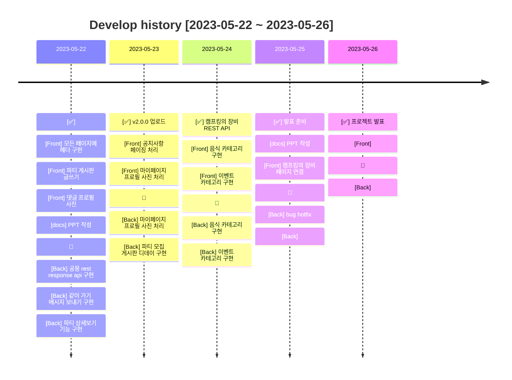

#

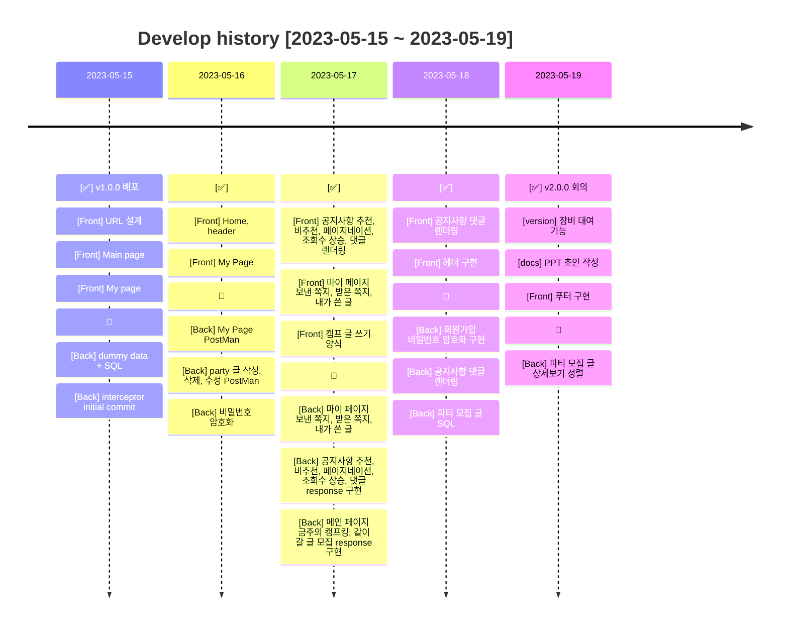

#

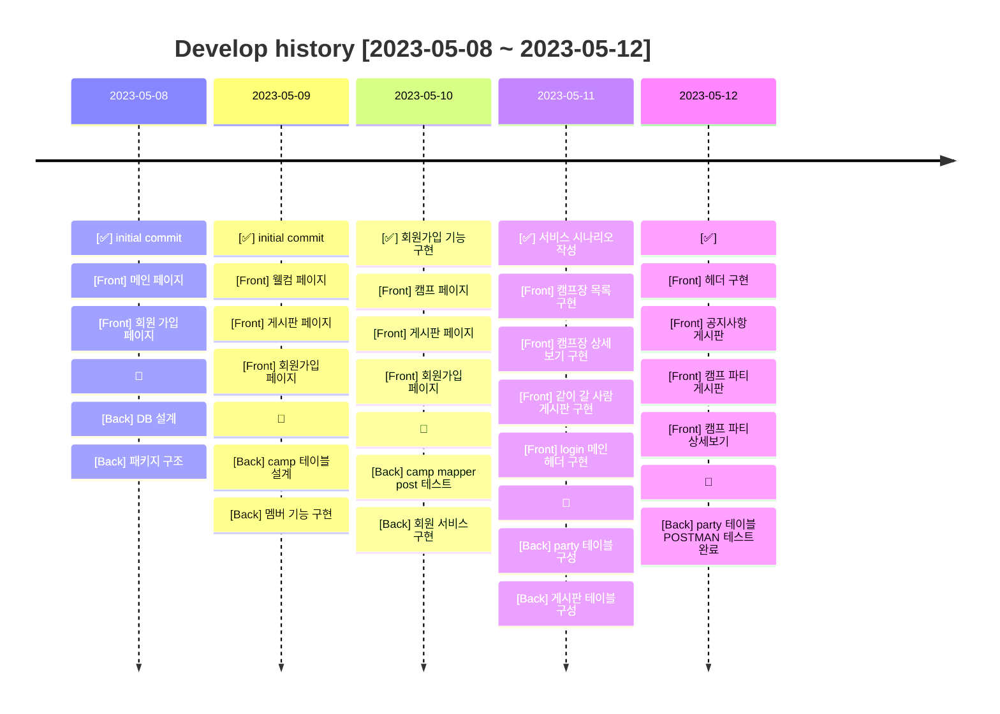

 
 
 

### 🖇️ Version Information

 

#### ✅ v2.0.0

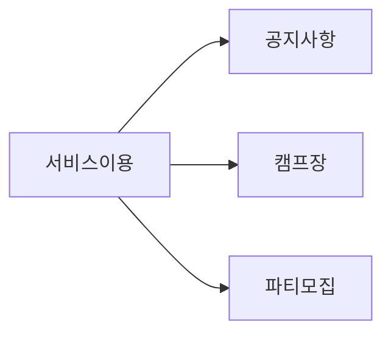

- #### V2.0.0 개발 전략
    - [v2.0.0] 공지사항 서비스
        - 관리자는 공지사항을 등록, 읽기, 수정, 삭제 할 수 있다.
        - 일반 회원은 공지사항을 읽기 할 수 있다.
            - 공지사항 목록은 SSR 방식으로 페이징 처리 한다.
        - 일반 회원은 공지사항에 댓글을 달 수 있다.
            - 댓글 작성은 CSR 방식으로 처리 한다.
        - 페이징 처리
    - [v2.0.0] 캠프장 서비스
        - 관리자는 캠프장을 등록, 읽기, 수정, 삭제 할 수 있다.
        - 일반 회원은 캠프장 목록을 볼 수 있다.
            - 검색, 정렬 기능
            - 검색 결과는 CSR 방식으로 제공 한다.
        - 일반 회원은 캠프장 상세보기 기능을 이용할 수 있다.
            - 지도뷰
            - 로드뷰
    - [v2.0.0] 파티 서비스
        - 같이 갈 멤버를 구하는 게시글을 작성, 수정, 삭제할 수 있다.
            - 모든 회원은 작성이 가능하다.
            - 본인이 작성한 글이 아니면 수정, 삭제는 불가하다.
        - 게시글에 쪽지를 보낼 수 있다.
            - 모든 회원은 파티 게시글에 대해 쪽지를 보낼 수 있다.
            - 본인이 작성한 글에는 쪽지를 보낼 수 없다.
            - 한 번 보낸 쪽지는 수정, 삭제가 불가하다. (보낸 사람 기준으로)
    - [v2.0.0] 마이 페이지 서비스
        - 내 정보를 수정할 수 있다.
            - 비밀번호, 닉네임, 핸드폰 번호
        - 내가 쓴 글을 조회할 수 있다.
            - 파티 게시판 글
        - 내가 보낸 쪽지를 조회할 수 있다.
            - 파티 게시판 쪽지
        - 내가 받은 쪽지를 조회할 수 있다.
            - 파티 게시판 쪽지

 
 
 

#### ✅ v1.0.0

---

- #### V1.0 개발 전략
    - [v1.0.0] 회원가입을 성공시킨다
        - [Front] 홈페이지로부터 유저의 ID 와 password 를 입력받는다
        - [Back] 회원가입된 아이디는 DB에 저장된다
        - [Front] 홈페이지로부터 유저의 ID 와 password 를 입력받는다
        - [Back] 회원가입된 아이디는 DB에 저장된다
    - [v1.0.0] 회원가입을 성공시킨다
        - [Front] 홈페이지로부터 유저의 ID 와 password 를 입력받는다
        - [Back] 회원가입된 아이디는 DB에 저장된다
        - [Front] 홈페이지로부터 유저의 ID 와 password 를 입력받는다
        - [Back] 회원가입된 아이디는 DB에 저장된다

 
 
 

### 📀 DataBase Diagram

---

 

### 📜 멤버, 게시판, 리플

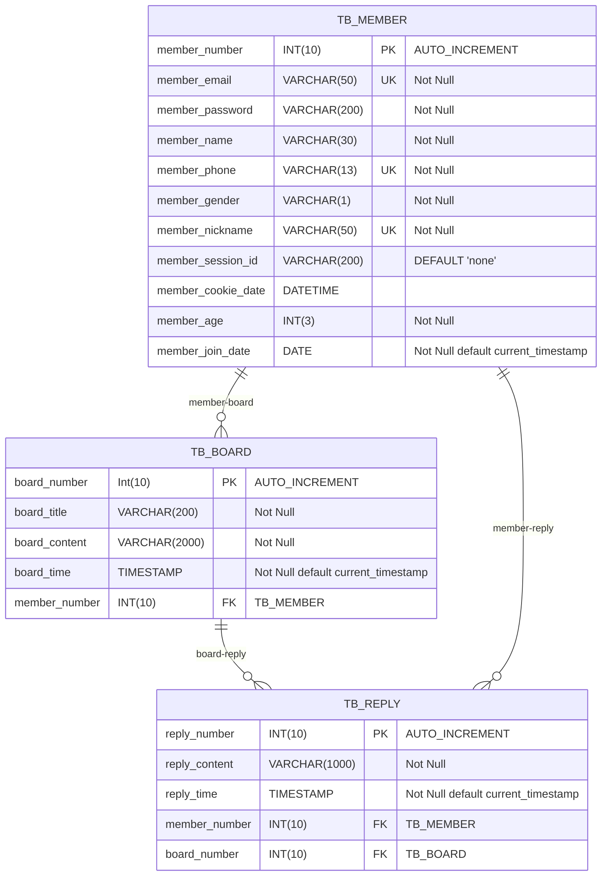

#

### 📜 멤버, 캠프, 파티 모집 게시판, 파티 모집 게시판의 리플

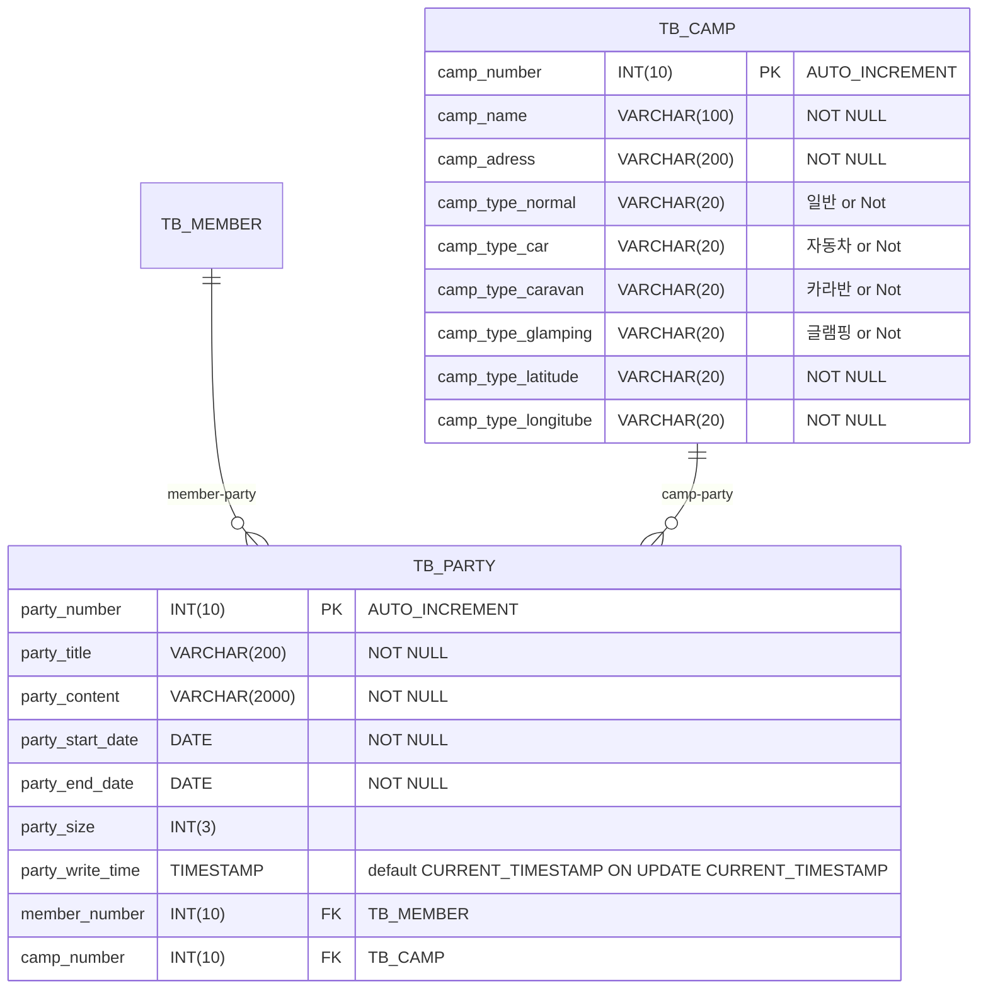

#

### 📜 파티 모집 메시지

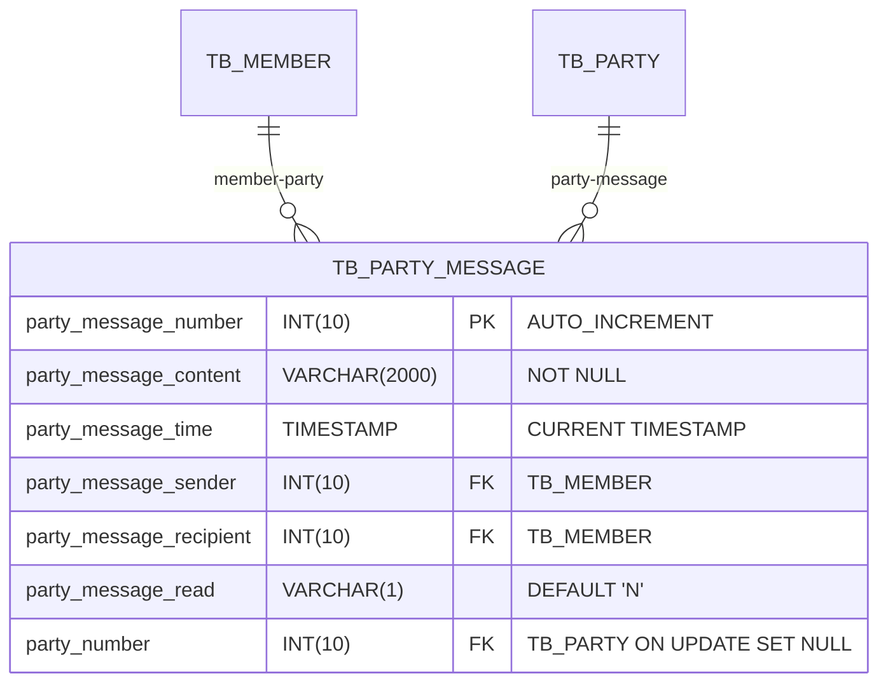

### 📜 캠프킹의 장비

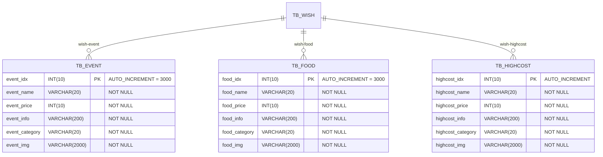

 
 
 
 

### 📍 MindMap

---

#### 📌 2023.05.22 ~ 2023.05.26 V3.0.0

 

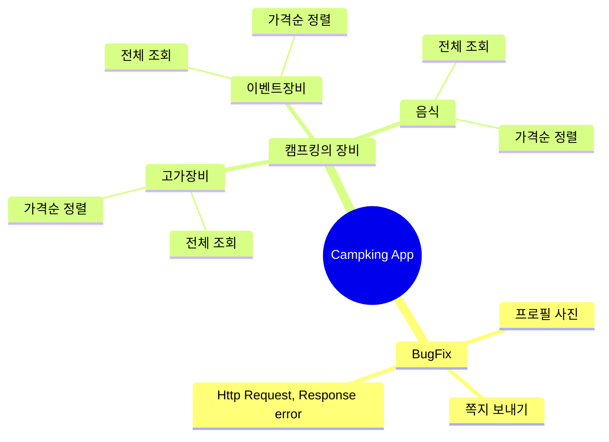

 

#### 📌 2023.05.15 ~ 2023.05.19 V2.0.0

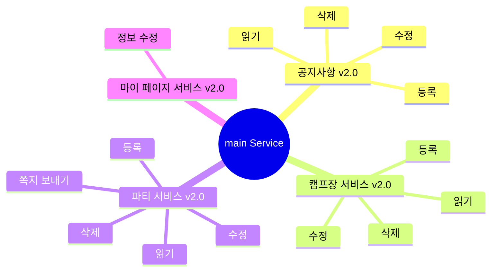

 
 

#### 📌 2023.05.08 ~ 2023.05.12 V1.0.0

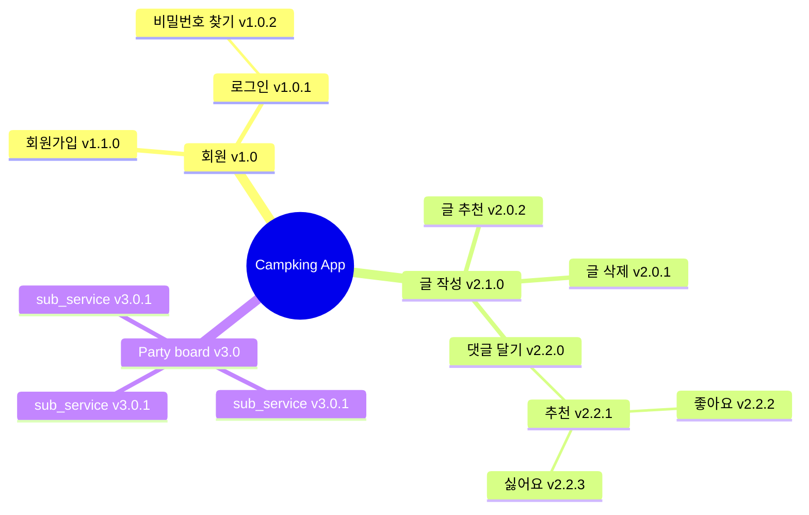

 
 

### 🪵 Git Flow

---

 

- #### main : 우리의 서비스가 출시되는 브랜치

> 1. 태그를 달아서 버전을 알려줍니다.
> 2. develop 브랜치만 merge 합니다.  
     $git merge develop  
     $git tag "v1.0.0"

- #### develop : 다음 출시 버전을 개발하는 브랜치

> 1. feat 브랜치들에서 개발한 병합합니다.
> 2. 커밋 이력을 남기기 위해 '--no-ff' 옵션을 부여합니다.  
     $git merge --no-ff feat/[name]/기능

- #### feat/[name]/front : Front 기능을 개발하는 브랜치
- #### feat/[name]/back : Back 기능을 개발하는 브랜치
- #### feat/이름이니셜/개발내용. ex) feat/lkd/member

> 1. feat/[이름 이니셜]/구현 기능 요약  
     $git switch -c feat/lkd/member  
     $작업중...  
     $작업 완료...  
     $git switch develop  
     $git merge --no-ff feat/lkd/member

- #### hotfix : 출시 버전에서 발생한 버그를 수정하는 브랜치

 
 

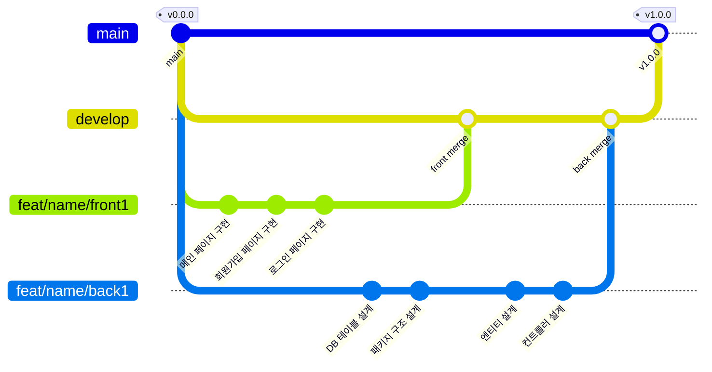

 
 
 
 

### 🖇️ Reference

---

- [COMMON]  
  [👉 UML](https://www.nextree.co.kr/p6753/)      
  [👉 클래스 다이어그램 툴](https://app.diagrams.net/?src=about)  
  [👉 README_mermaid](https://mermaid.js.org/syntax/flowchart.html)  
  [👉 Git_flow1](https://techblog.woowahan.com/2553/)  
  [👉 Git_flow2](https://www.youtube.com/watch?v=wtsr5keXUyE&ab_channel=%EC%9A%B0%EC%95%84%ED%95%9C%ED%85%8C%ED%81%AC)

- [FRONT]  
  [👉 daisy_UI](https://daisyui.com/components/)    
  [👉 font_awesome](https://fontawesome.com/search?o=r&m=free)    
  [👉 tail_wind](https://nerdcave.com/tailwind-cheat-sheet)

- [BACK]  
  [👉 Java 컨벤션](https://developerfarm.wordpress.com/2012/02/03/object_calisthenics_summary/)  
  [👉 디자인 패턴](https://refactoring.guru/ko/design-patterns/what-is-pattern)

- [DB]  
  [👉 Null](https://naver.com)